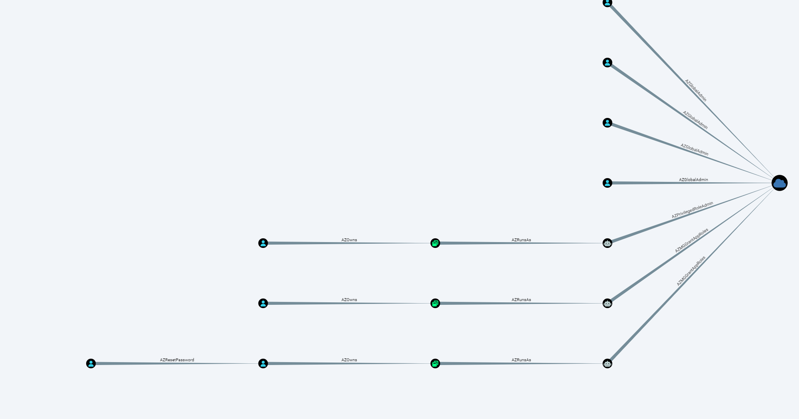

# BadZure

BadZure is a PowerShell script that leverages the Microsoft Graph SDK to orchestrate the setup of Azure Active Directory tenants, populating them with diverse entities while also introducing common security misconfigurations to create vulnerable tenants with multiple attack paths.

Specifically, BadZure automates the process of creating multiple entities such as: users, groups, application registrations, service principals and administrative units. To simulate common security misconfigurations in real environments, it randomly assigns Azure AD roles, Graph permissions and application ownership privileges to randomly picked security principals enabling the creation of unique attack paths within a controlled and vulnerable tenant. In line with 'Assume Breach' principle, BadZure provides users with two methods of initial access to the vulnerablite tenants it creates thereby simulating account takeover scenarios.

The key advantage of BadZure lies in its ability to rapidly populate and purge existing Azure AD tenants with randomly generated vulnerable configurations facilitating continous and iterative attack simulation (red team) and detection development (blue team) experimentation. It is designed for security practitioners with an interest in exploring and understanding Azure AD security. 

## Goals / Use Cases

BadZure was written to enable the author and detection engineering teams to quickly stand up vulnerable environments and collect attack telemetry to develop detection analytics against Azure AD attacks. 

An Azure AD tenant populated with BadZure also enables red and blue teams to:

* Experiment with common Azure AD attack vectors (for ideas => [AzureAD Attack and Defense Playbook](https://github.com/Cloud-Architekt/AzureAD-Attack-Defense))
* Obtain attack telemetry to build, test and enhance detection controls
* Execute purple team exercises in a safe setting
* Faciliate hands-on Azure AD security training

## Attack Paths

### Initial Access

BadZure facilitates initial access by simulating account takover vectors such as password attacks and token theft. It achieves this through the assignment of a password (randomly generated or user-defined) or by supplying principal JWT access tokens. These credentials or tokens are then presented in the output, enabling users to step into the shoes of an attacker who has already gained access to an account.

### Privilege Escalation

BadZure crafts privilege escalation attack vectors by simulating service principal abuse scenarios. It achieves this by intentionally introducing misconfigurations, typically exploited in real-world threat scenarios. A BloodHound-generated graph, showcasing the scenarios BadZure simulates, is shown below.



## Quick Start Guide

### Create an Azure AD Tenant 

[Creating an Azure subscription](https://learn.microsoft.com/en-us/training/modules/create-an-azure-account/1-introduction) will also provide you an Azure AD tenant. 

**Note:** Utilizing BadZure within your Azure subscription won't lead to any additional costs as it only requires an [Azure AD Free license](https://azure.microsoft.com/en-us/free/).

### Create a Global Administrator


[Assign Azure AD roles to users](https://learn.microsoft.com/en-us/azure/active-directory/roles/manage-roles-portal)


### Install Dependencies

````
Install-Module Microsoft.Graph -Scope CurrentUser
````

### Clone Repository and Import Module

````
git clone https://github.com/mvelazc0/BadZure
cd BadZure
. ./Invoke-BadZure.ps1
````
### Set up AzureAD with BadZure

````
# Get Help Menu
Invoke-BadZure

# Populate a tenant and enable attack paths
Invoke-BadZure -Build

# Use a custom password for initial access
Invoke-BadZure -Build -Password Summer2023!

# Use tokens for initial access
Invoke-BadZure -Build -Token

# Populate a tenant without attack paths
Invoke-BadZure -Build -NoAttackPaths

````

### Experiment

* Simulate attacks
* Review resulting telemetry

### Purge AzureAD with BadZure

````
# Destroy all created identities
Invoke-BadZure -Destroy
````

## Author

* **Mauricio Velazco** - [@mvelazco](https://twitter.com/mvelazco)

## Acknowledgments

This project is possible thanks to all the Azure AD security community and their work. Special thanks to:

* [Cloud Katana](https://github.com/Azure/Cloud-Katana) by [Roberto Rodriguez](https://twitter.com/Cyb3rWard0g)
* [Azure Attack Paths](https://cloudbrothers.info/en/azure-attack-paths/) by [Fabian Bader](https://twitter.com/fabian_bader) 
* [Azure AD - Attack and Defense Playbook](https://github.com/Cloud-Architekt/AzureAD-Attack-Defense) by [Sami Lamppu](https://twitter.com/samilamppu) and [Thomas Naunheim](https://twitter.com/Thomas_Live)
* Blog posts & talks by [@_wald0](https://twitter.com/_wald0), [@_dirkjan](https://twitter.com/_dirkjan), [@DrAzureAD](https://twitter.com/DrAzureAD), [@Haus3c](https://twitter.com/Haus3c), [@kfosaaen](https://twitter.com/kfosaaen), [@inversecos](https://twitter.com/inversecos) and others.

## License

This project is licensed under the Apache 2.0 License - see the [LICENSE](LICENSE) file for details
